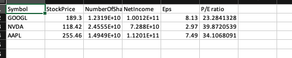

# FinancialReport
## Investment Tool for fetching data about your stock portfolio and storing it in easy to use excel format
Create an account and copy the api-key from site.financialmodelingprep.com

Use `./financialReport -apiKey=financialmodelingprep-api-key NVDA GOOGL SOME-SYMBOL` to gather financial data and store in an excel file

  
